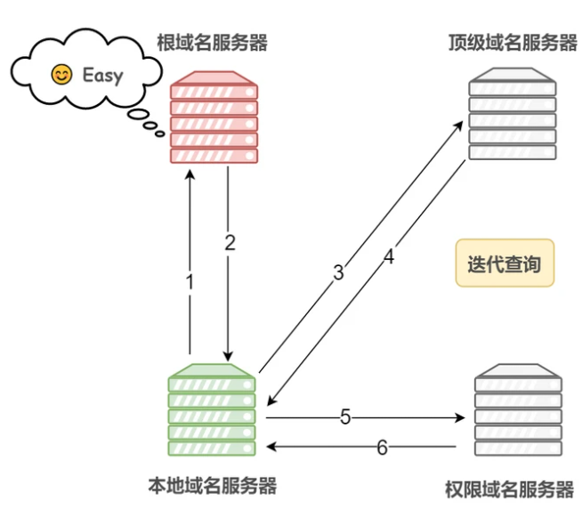

## 说一下 http 和 https

http 是一个用于从 www 服务器传输超文本到本地浏览器的一种传输协议。
https 则是在 http 下加入了 SSL 层，比 http 更加的安全。
他们的区别：

1. https 比 http 安全，原因是因为 http 是明文传输，但是 https 则在 http 下加入了 SSL 层，可以防止数据在传输过程中被窃取。
2. http 端口是 80，https 端口是 443。
3. https 握手阶段比较耗时，会使页面加载时间延长，耗电增加。
4. https 需要 ca 证书，费用比较高，功能越强大的证书费用越高。

## https 工作原理

<a href='https://vue3js.cn/interview/http/HTTPS.html#%E4%BA%8C%E3%80%81%E5%A6%82%E4%BD%95%E5%81%9A'>原理都在这篇文章中</a>
https://vue3js.cn/interview/http/HTTPS.html#%E4%BA%8C%E3%80%81%E5%A6%82%E4%BD%95%E5%81%9A

1. 客户端使用 https url 访问服务器，则要求 web 服务器建立 ssl 链接
2. Web 服务器接收到客户端的请求之后，会将网站的证书（证书中包含了公钥），传输给客户端
3. 客户端和 web 服务器开始协商 ssl 链接的安全等级，也就是加密等级
4. 客户端浏览器通过双方协商一致的安全等级，建立会话密钥，然后通过网站的公钥来加密会话密钥，并传送给网站
5. Web 服务器通过自己的私钥解密出会话密钥
6. Web 服务器通过会话密钥加密与客户端之间的通信

### 对称加密

对称加密指的是加密和解密使用的秘钥都是同一个，是对称的。只要保证了密钥的安全，那整个通信过程就可以说具有了机密性。
对称加密是最快速、最简单的一种加密方式，加密与解密用的是同样的密钥。对称加密有很多种算法，由于它效率很高，所以被广泛使用在很多加密协议的核心当中。对称加密通常使用的是相对较小的密钥，一般小于 256 bit。因为密钥越大，加密越强，但加密与解密的过程越慢。如果你只用 1 bit 来做这个密钥，那黑客们可以先试着用 0 来解密，不行的话就再用 1 解；但如果你的密钥有 1 MB 大，黑客们可能永远也无法破解，但加密和解密的过程要花费很长的时间。密钥的大小既要照顾到安全性，也要照顾到效率

<a href='https://blog.51cto.com/u_11093860/1968046'>对称和非对称加密</a>
https://blog.51cto.com/u_11093860/1968046

### 非对称加密

非对称加密，存在两个秘钥：一个叫公钥，一个叫私钥。两个秘钥是不同的，公钥可以公开给任何人使用，私钥则需要保密

公钥和私钥都可以用来加密解密，但公钥加密后只能用私钥解密，反过来，私钥加密后也只能用公钥解密

比如，你向银行请求公钥，银行将公钥发给你，你使用公钥对消息加密，那么只有私钥的持有人--银行才能对你的消息解密。与对称加密不同的是，银行不需要将私钥通过网络发送出去，因此安全性大大提高。

虽然非对称加密很安全，但是和对称加密比起来，它非常的慢，所以我们还是要用对称加密来传送消息，但对称加密所使用的密钥我们可以通过非对称加密的方式发送出去。

就算途中被黑客截获，由于只有对应的私钥才可以解锁文件，而黑客并没有与之对应的私钥，所以并无法打开这份文件。

### 对称和非对称的总结

- 对称加密：加密与解密使用的是同样的密钥，所以速度快，但由于需要将密钥在网络传输，所以安全性不高。

- 非对称加密使用了一对密钥，公钥与私钥，所以安全性高，但加密与解密速度慢。

- 解决的办法是将对称加密的密钥使用非对称加密的公钥进行加密，然后发送出去，接收方使用私钥进行解密得到对称加密的密钥，然后双方可以使用对称加密来进行沟通。

### 混合加密

在 HTTPS 通信过程中，采用的是对称加密+非对称加密，也就是混合加密

在对称加密中讲到，如果能够保证了密钥的安全，那整个通信过程就可以说具有了机密性

而 HTTPS 采用非对称加密解决秘钥交换的问题

具体做法是发送密文的一方使用对方的公钥进行加密处理“对称的密钥”，然后对方用自己的私钥解密拿到“对称的密钥”
这样可以确保交换的密钥是安全的前提下，使用对称加密方式进行通信

举个例子：
网站秘密保管私钥，在网上任意分发公钥，你想要登录网站只要用公钥加密就行了，密文只能由私钥持有者才能解密。而黑客因为没有私钥，所以就无法破解密文

上述的方法解决了数据加密，在网络传输过程中，数据有可能被篡改，并且黑客可以伪造身份发布公钥，如果你获取到假的公钥，那么混合加密也并无多大用处，你的数据扔被黑客解决

因此，在上述加密的基础上仍需加上完整性、身份验证的特性，来实现真正的安全，实现这一功能则是摘要算法

### 摘要算法

实现完整性的手段主要是摘要算法，也就是常说的散列函数、哈希函数

可以理解成一种特殊的压缩算法，它能够把任意长度的数据“压缩”成固定长度、而且独一无二的“摘要”字符串，就好像是给这段数据生成了一个数字“指纹”
摘要算法保证了“数字摘要”和原文是完全等价的。所以，我们只要在原文后附上它的摘要，就能够保证数据的完整性

比如，你发了条消息：“转账 1000 元”，然后再加上一个 SHA-2 的摘要。网站收到后也计算一下消息的摘要，把这两份“指纹”做个对比，如果一致，就说明消息是完整可信的，没有被修改

### 数字签名

数字签名能确定消息确实是由发送方签名并发出来的，因为别人假冒不了发送方的签名

原理其实很简单，就是用私钥加密，公钥解密

签名和公钥一样完全公开，任何人都可以获取。但这个签名只有用私钥对应的公钥才能解开，拿到摘要后，再比对原文验证完整性，就可以像签署文件一样证明消息确实是你发的
和消息本身一样，因为谁都可以发布公钥，我们还缺少防止黑客伪造公钥的手段，也就是说，怎么判断这个公钥就是你的公钥

这时候就需要一个第三方，就是证书验证机构

### CA 验证机构

数字证书认证机构处于客户端与服务器双方都可信赖的第三方机构的立场

CA 对公钥的签名认证要求包括序列号、用途、颁发者、有效时间等等，把这些打成一个包再签名，完整地证明公钥关联的各种信息，形成“数字证书”

流程如下图：


- 服务器的运营人员向数字证书认证机构提出公开密钥的申请
- 数字证书认证机构在判明提出申请者的身份之后，会对已申请的公开密钥做数字签名
- 然后分配这个已签名的公开密钥，并将该公开密钥放入公钥证书后绑定在一起
- 服务器会将这份由数字证书认证机构颁发的数字证书发送给客户端，以进行非对称加密方式通信

接到证书的客户端可使用数字证书认证机构的公开密钥，对那张证书上的数字签名进行验证，一旦验证通过，则证明：

    - 认证服务器的公开密钥的是真实有效的数字证书认证机构

    - 服务器的公开密钥是值得信赖的

### 总结

可以看到，HTTPS 与 HTTP 虽然只差一个 SSL，但是通信安全得到了大大的保障，通信的四大特性都以解决，解决方式如下：

机密性：混合算法
完整性：摘要算法
身份认证：数字签名
不可否定：数字签名
同时引入第三方证书机构，确保公开秘钥的安全性

## HTTP 1.0 和 HTTP 1.1 的区别：

- 连接方面，http1.0 默认使用非持久连接(每次请求都需要与服务器建立一个 TCP 连接,服务器完成请求处理后立即断开 TCP 连接，服务器不跟踪每个客户也不记录过去的请求,例如，解析 html 文件，当发现文件中存在资源文件的时候，这时候又创建单独的链接。最终导致，一个 html 文件的访问包含了多次的请求和响应，每次请求都需要创建连接、关闭连接。这种形式明显造成了性能上的缺陷)，而 http1.1 默认使用持久连接。http1.1 通过使用持久连接来使多个 http 请求复用同一个 TCP 连接，以此来避免使用非持久连接时每次需要建立连接的时延。

- 资源请求方面，在 http1.0 中，存在一些浪费带宽的现象，例如客户端只是需要某个对象的一部分，而服务器却将整个对象送过来了，并且不支持断点续传功能，http1.1 则在请求头引入了 range 头域，它允许只请求资源的某个部分，即返回码是 206（客户端表明自己只需要目标 URL 上的部分资源的时候返回的.这种情况经常发生在客户端继续请求一个未完成的下载的时候(通常是当客户端加载一个体积较大的嵌入文件,比如视屏或 PDF 文件),或者是客户端尝试实现带宽遏流的时候），这样就方便了开发者自由的选择以便于充分利用带宽和连接。

- 缓存方面，在 http1.0 中主要使用 header 里的 If-Modified-Since、Expires 来做为缓存判断的标准，http1.1 则引入了更多的缓存控制策略，例如 Etag/If-None-Match、Last-Modified/If-Modified-Since 等更多可供选择的缓存头来控制缓存策略。

- http1.1 中新增了 host 字段，用来指定服务器的域名。http1.0 中认为每台服务器都绑定一个唯一的 IP 地址，因此，请求消息中的 URL 并没有传递主机名（hostname）。但随着虚拟主机技术的发展，在一台物理服务器上可以存在多个虚拟主机，并且它们共享一个 IP 地址。因此有了 host 字段，这样就可以将请求发往到同一台服务器上的不同网站。

- http1.1 相对于 http1.0 还新增了很多请求方法，如 PUT、HEAD、OPTIONS 等。

## HTTP 1.1 和 HTTP 2.0 的区别

- 二进制编码：HTTP/2 是一个二进制协议。在 HTTP/1.1 版中，报文的头信息必须是文本（ASCII 编码），数据体可以是文本，也可以是二进制。HTTP/2 则是一个彻底的二进制协议，头信息和数据体都是二进制，并且统称为"帧"，可以分为头信息帧和数据帧。 HTTP2 中，同域名下所有通信都在单个连接上完成，该连接可以承载任意数量的双向数据流。每个数据流都以消息的形式发送，而消息又由一个或多个帧组成。多个帧之间可以乱序发送，根据帧首部的流标识可以重新组装，这也是多路复用同时发送数据的实现条件。

- 多路复用：HTTP/2 实现了多路复用，HTTP/2 仍然复用 TCP 连接，但是在一个连接里，客户端和服务器都可以同时发送多个请求或回应，而且不用按照顺序一一发送，这样就避免了"队头堵塞"的问题。

- 数据流：HTTP/2 使用了数据流的概念，因为 HTTP/2 的数据包是不按顺序发送的，同一个连接里面连续的数据包，可能属于不同的请求。因此，必须要对数据包做标记，指出它属于哪个请求。HTTP/2 将每个请求或回应的所有数据包，称为一个数据流。每个数据流都有一个独一无二的编号。数据包发送时，都必须标记数据流 ID ，用来区分它属于哪个数据流。

- 头信息压缩：HTTP/2 实现了头信息压缩，由于 HTTP 1.1 协议不带状态，每次请求都必须附上所有信息。所以，请求的很多字段都是重复的，比如 Cookie 和 User Agent ，一模一样的内容，每次请求都必须附带，这会浪费很多带宽，也影响速度。HTTP/2 对这一点做了优化，引入了头信息压缩机制。一方面，头信息使用 gzip 或 compress 压缩后再发送；另一方面，客户端和服务器同时维护一张头信息表，所有字段都会存入这个表，生成一个索引号，以后就不发送同样字段了，只发送索引号，这样就能提高速度了。

- 服务器推送（这种方式非常合适加载静态资源）：HTTP/2 允许服务器未经请求，主动向客户端发送资源，这叫做服务器推送。使用服务器推送提前给客户端推送必要的资源，这样就可以相对减少一些延迟时间。这里需要注意的是 http2 下服务器主动推送的是静态资源，和 WebSocket 以及使用 SSE 等方式向客户端发送即时数据的推送是不同的。

### 队头堵塞：

队头阻塞是由 HTTP 基本的“请求 - 应答”模型所导致的。HTTP 规定报文必须是“一发一收”，这就形成了一个先进先出的“串行”队列。队列里的请求是没有优先级的，只有入队的先后顺序，排在最前面的请求会被最优先处理。如果队首的请求因为处理的太慢耽误了时间，那么队列里后面的所有请求也不得不跟着一起等待，结果就是其他的请求承担了不应有的时间成本，造成了队头堵塞的现象。

## HTTP3.0(QUIC)

QUIC (Quick UDP Internet Connections), 快速 UDP 互联网连接。
QUIC 是基于 UDP 协议的。

两个主要特性：
（1）线头阻塞(HOL)问题的解决更为彻底：
基于 TCP 的 HTTP/2，尽管从逻辑上来说，不同的流之间相互独立，不会相互影响，但在实际传输方面，数据还是要一帧一帧的发送和接收，一旦某一个流的数据有丢包，则同样会阻塞在它之后传输的流数据传输。而基于 UDP 的 QUIC 协议则可以更为彻底地解决这样的问题，让不同的流之间真正的实现相互独立传输，互不干扰。
（2）切换网络时的连接保持：
当前移动端的应用环境，用户的网络可能会经常切换，比如从办公室或家里出门，WiFi 断开，网络切换为 3G 或 4G。基于 TCP 的协议，由于切换网络之后，IP 会改变，因而之前的连接不可能继续保持。而基于 UDP 的 QUIC 协议，则可以内建与 TCP 中不同的连接标识方法，从而在网络完成切换之后，恢复之前与服务器的连接。
（3）更安全
TCP 协议头没有经过任何加密和认证，在传输过程中很容易被中间网络设备篡改、注入和窃听。

QUIC 的 packet 可以说武装到了牙齿，除了个别报文，比如 PUBLIC_RESET 和 CHLO，所有报文头部都是经过认证的，报文 Body 都是经过加密的。
所以只要对 QUIC 做任何更改，接收端都能及时发现，有效地降低了安全风险。

（4）向前纠错机制
QUIC 协议有一个非常独特的特性，称为向前纠错（Foward Error Connec，FEC），每个数据包除了它本身的内容之外还包括了其他数据包的数据，因此少量的丢包可以通过其他包的冗余数据直接组装而无需重传。

向前纠错牺牲了每个数据包可以发送数据的上限，但是带来的提升大于丢包导致的数据重传，因为数据重传将会消耗更多的时间（包括确认数据包丢失，请求重传，等待新数据包等步骤的时间消耗）。

例如：

我总共发送三个包，协议会算出这个三个包的异或值并单独发出一个校验包，也就是总共发出了四个包。
当其中出现了非校验包丢失的情况，可以通过另外三个包计算出丢失的数据包的内容。
当然这种技术只能使用在丢失一个包的情况下，如果出现丢失多个包，就不能使用纠错机制了，只能使用重传的方式了。

TCP:100ms TCP+TLS:2/300ms QUIC:0/100ms

## TCP 三次握手和四次挥手

<a href='https://segmentfault.com/a/1190000022410446'>文章</a>

### 三次握手：客户端和服务端建立连接的过程

三次握手其实就是：客户端和服务端建立连接的过程，在这过程中需要客户端和服务器总共发送 3 个包

主要作用就是为了确认双方的接收能力和发送能力是否正常、指定自己的初始化序列号为后面的可靠性传送做准备

过程如下：

- 第一次握手：客户端给服务端发一个 SYN 报文，并指明客户端的初始化序列号 ISN(c)，此时客户端处于 SYN_SENT 状态

- 第二次握手：服务器收到客户端的 SYN 报文之后，会以自己的 SYN 报文作为应答，为了确认客户端的 SYN，将客户端的 ISN+1 作为 ACK 的值，此时服务器处于 SYN_RCVD 的状态

- 第三次握手：客户端收到 SYN 报文之后，会发送一个 ACK 报文，值为服务器的 ISN+1。此时客户端处于 ESTABLISHED 状态。服务器收到 ACK 报文之后，也处于 ESTABLISHED 状态，此时，双方已建立起了连接

每一次握手的作用如下：

- 第一次握手：客户端发送网络包，服务端收到了 这样服务端就能得出结论：客户端的发送能力、服务端的接收能力是正常的。
- 第二次握手：服务端发包，客户端收到了 这样客户端就能得出结论：服务端的接收、发送能力，客户端的接收、发送能力是正常的。不过此时服务器并不能确认客户端的接收能力是否正常
- 第三次握手：客户端发包，服务端收到了。 这样服务端就能得出结论：客户端的接收、发送能力正常，服务器自己的发送、接收能力也正常

通过三次握手，就能确定双方的接收和发送能力是正常的。之后就可以正常通信了

### 四次挥手：客户端与服务端断开连接的过程

过程如下：

- 第一次挥手：客户端发送一个 FIN 报文，报文中会指定一个序列号。此时客户端处于 FIN_WAIT1 状态，停止发送数据，等待服务端的确认
- 第二次挥手：服务端收到 FIN 之后，会发送 ACK 报文，且把客户端的序列号值 +1 作为 ACK 报文的序列号值，表明已经收到客户端的报文了，此时服务端处于 CLOSE_WAIT 状态
- 第三次挥手：如果服务端也想断开连接了，和客户端的第一次挥手一样，发给 FIN 报文，且指定一个序列号。此时服务端处于 LAST_ACK 的状态
- 第四次挥手：客户端收到 FIN 之后，一样发送一个 ACK 报文作为应答，且把服务端的序列号值 +1 作为自己 ACK 报文的序列号值，此时客户端处于 TIME_WAIT 状态。需要过一阵子以确保服务端收到自己的 ACK 报文之后才会进入 CLOSED 状态，服务端收到 ACK 报文之后，就处于关闭连接了，处于 CLOSED 状态

客户端发送一个断开连接的请求，fin=1。服务端接收到请求之后，响应一个 ack=1，代表已经收到了你的请求，表示我仅仅同意你与我断开连接。与此同时服务端向客户端发送一个断开连接的命令，fin=1，客户端接收到 fin=1 的时候，客户端就开始断开连接，回一个 ack=1 的消息

## 为什么需要三次握手而不是两次握手

### 第一种原因：

第一次握手 a 发给 b，此时 b 知道 ab 是通的，但 a 还不知道！
第二次握手是 b 发给 a，此时 a 知道 ab 和 ba 都是通的，但 b 只知道 ab 通，不知道 ba 通不通！
第三次握手是 a 发给 b，此时 b 也知道 ba 通的，完毕

如果是两次握手，发送端可以确定自己发送的信息能对方能收到，也能确定对方发的包自己能收到，但接收端只能确定对方发的包自己能收到 无法确定自己发的包对方能收到

### 第二种原因：

第三次握手是为了防止失效的连接请求到达服务器，让服务器错误打开连接。
客户端发送的连接请求如果在网络中滞留，那么就会隔很长一段时间才能收到服务器端发回的连接确认。
客户端等待一个超时重传时间之后，就会重新请求连接。
但是这个滞留的连接请求最后还是会到达服务器，如果不进行三次握手，那么服务器就会打开两个连接。
如果有第三次握手，客户端会忽略服务器之后发送的对滞留连接请求的连接确认，不进行第三次握手，因此就不会再次打开连接。

## 为什么是四次挥手

关闭连接时，客户端向服务端发送 FIN 时，仅仅表示客户端不再发送数据了但是还能接收数据。
服务器收到客户端的 FIN 报文时，先回一个 ACK 应答报文，而服务端可能还有数据需要处理和发送，等服务端不再发送数据时，才发送 FIN 报文给客户端来表示同意现在关闭连接。
从上面过程可知，服务端通常需要等待完成数据的发送和处理，所以服务端的 ACK 和 FIN 一般都会分开发送，从而比三次握手导致多了一次。

## TCP 和 UDP 的区别

1. Tcp 面向连接，UDP 面向无连接即发送数据前不需要先建立连接
2. Tcp 的三次握手保证了可靠性。也就是说 Tcp 传送的数据无差错，不丢失不重复，且按顺序到达。但是 UDP 是无连接的，不可靠。
3. Tcp 只能是 1 对 1 对，UDP 支持 1 对 1，1 对多
4. UDP 比 Tcp 传输速度快，实施性更好，也就说网络出现阻塞不会使得发送速率降低

## DNS 解析流程

<a href='https://vue3js.cn/interview/http/DNS.html#%E4%BA%94%E3%80%81%E6%9F%A5%E8%AF%A2%E8%BF%87%E7%A8%8B'>文章</a>

### DNS 是什么

DNS 域名系统，是互联网一项服务，是进行域名和与之相对应的 IP 地址进行转换的服务器

简单来讲，DNS 相当于一个翻译官，负责将域名翻译成 ip 地址

- IP 地址：一长串能够唯一地标记网络上的计算机的数字
- 域名：是由一串用点分隔的名字组成的 Internet 上某一台计算机或计算机组的名称，用于在数据传输时对计算机的定位标识

### 域名

域名是一个具有层次的结构，从上到下一次为根域名、顶级域名、二级域名、三级域名...


例如`www.xxx.com`，`www` 为三级域名、`xxx` 为二级域名、`com` 为顶级域名，系统为用户做了兼容，域名末尾的根域名`.`一般不需要输入

在域名的每一层都会有一个域名服务器，如下图：

除此之外，还有电脑默认的本地域名服务器

### 查询方式

DNS 查询的方式有两种：

- 递归查询：如果 A 请求 B，那么 B 作为请求的接收者一定要给 A 想要的答案

  

- 迭代查询：如果接收者 B 没有请求者 A 所需要的准确内容，接收者 B 将告诉请求者 A，如何去获得这个内容，但是自己并不去发出请求
  

### 域名缓存

在域名服务器解析的时候，使用缓存保存域名和 IP 地址的映射

计算机中 `DNS` 的记录也分成了两种缓存方式：

- 浏览器缓存：浏览器在获取网站域名的实际 IP 地址后会对其进行缓存，减少网络请求的损耗
- 操作系统缓存：操作系统的缓存其实是用户自己配置的 `hosts` 文件

### 查询过程

- 首先搜索浏览器的 DNS 缓存，缓存中维护一张域名与 IP 地址的对应表

- 若没有命中，则继续搜索操作系统的 DNS 缓存

- 若仍然没有命中，则操作系统将域名发送至本地域名服务器，本地域名服务器采用递归查询自己的 DNS 缓存，查找成功则返回结果

- 若本地域名服务器的 DNS 缓存没有命中，则本地域名服务器向上级域名服务器进行迭代查询

  - 首先本地域名服务器向根域名服务器发起请求，根域名服务器返回顶级域名服务器的地址给本地服务器
  - 本地域名服务器拿到这个顶级域名服务器的地址后，就向其发起请求，获取权限域名服务器的地址
  - 本地域名服务器根据权限域名服务器的地址向其发起请求，最终得到该域名对应的 IP 地址

- 本地域名服务器将得到的 IP 地址返回给操作系统，同时自己将 IP 地址缓存起来

- 操作系统将 IP 地址返回给浏览器，同时自己也将 IP 地址缓存起

- 至此，浏览器就得到了域名对应的 IP 地址，并将 IP 地址缓存起
  

## CDN 原理

### 是什么

CDN 即内容分发网络，简单来讲，CDN 就是根据用户位置分配最近的资源。CDN 的关键技术主要有内容存储和分发技术。

### 原理分析

- 在没有应用 CDN 时，我们使用域名访问某一个站点时的路径为：
  用户提交域名 → 浏览器对域名进行解释 →DNS 解析得到目的主机的 IP 地址 → 根据 IP 地址访问发出请求 → 得到请求数据并回复

- 应用 CDN 后，DNS 返回的不再是 IP 地址，而是一个 CNAME(Canonical Name ) 别名记录，指向 CDN 的全局负载均衡

  CNAME 实际上在域名解析的过程中承担了中间人（或者说代理）的角色，这是 CDN 实现的关键

### 负载均衡系统

由于没有返回 IP 地址，于是本地 DNS 会向负载均衡系统再发送请求 ，则进入到 CDN 的全局负载均衡系统进行智能调度：

- 看用户的 IP 地址，查表得知地理位置，找相对最近的边缘节点

- 看用户所在的运营商网络，找相同网络的边缘节点

- 检查边缘节点的负载情况，找负载较轻的节点

- 其他，比如节点的“健康状况”、服务能力、带宽、响应时间等

结合上面的因素，得到最合适的边缘节点，然后把这个节点返回给用户，用户就能够就近访问 CDN 的缓存代理

整体流程如下图:


### 缓存代理

缓存系统是 CDN 的另一个关键组成部分，缓存系统会有选择地缓存那些最常用的那些资源

其中有两个衡量 CDN 服务质量的指标：

- 命中率：用户访问的资源恰好在缓存系统里，可以直接返回给用户，命中次数与所有访问次数之比
- 回源率：缓存里没有，必须用代理的方式回源站取，回源次数与所有访问次数之比

缓存系统也可以划分出层次，分成一级缓存节点和二级缓存节点。一级缓存配置高一些，直连源站，二级缓存配置低一些，直连用户

回源的时候二级缓存只找一级缓存，一级缓存没有才回源站，可以有效地减少真正的回源

现在的商业 CDN 命中率都在 90% 以上，相当于把源站的服务能力放大了 10 倍以上

### 步骤

资源上传到 CDN 之后，当用户访问 cdn 的资源地址之后会经历下面的步骤：

1. 首先经过本地的 dns 解析，请求 cname 指向的那台 cdn 专用的 dns 服务器
2. DNS 服务器返回全局负载均衡的服务器 ip 给用户
3. 用户请求全局负载均衡服务器，服务器根据 ip 返回所在区域的负载均衡服务器 ip 给用户
4. 用户请求区域负载均衡服务器，负载均衡服务器根据用户 ip 选择距离近的，并且存在用户所需内容的，负载比较合适的一台缓存服务器 ip 给用户。当没有对应内容的时候，会去上一级缓存服务器去找，直到找到资源所在的源站服务器，并且缓存在缓存服务器中。用户下一次在请求该资源，就可以就近拿缓存了。
5. 注意：因为 cdn 的负载均衡和就近选择缓存都是根据用户的 ip 来的，服务器只能拿到 local dns 的 ip，也就是网络设置中设置的 dns ip，如果这个设置的不合理，那么可能起不到加速的效果。可能就近找到的缓存服务器实际离得很远。

### 总结：

CDN 目的是为了改善互联网的服务质量，通俗一点说其实就是提高访问速度

CDN 构建了全国、全球级别的专网，让用户就近访问专网里的边缘节点，降低了传输延迟，实现了网站加速

通过 CDN 的负载均衡系统，智能调度边缘节点提供服务，相当于 CDN 服务的大脑，而缓存系统相当于 CDN 的心脏，缓存命中直接返回给用户，否则回源

需要注意的是一切都是根据请求的 ip 来的，如果 ip 不合理，那么可能起不到加速效果。缓存和负载均衡的思想在减轻服务器压力方面其实是很常见的。

## WebSocket 的实现与应用

### 是什么

WebSocket，是一种网络传输协议，位于 OSI 模型的应用层。可在单个 TCP 连接上进行全双工通信，能更好的节省服务器资源和带宽并达到实时通迅

客户端和服务器只需要完成一次握手，两者之间就可以创建持久性的连接（http 协议不支持持久性连接。Http1.0 和 HTTP1.1 都不支持持久性的链接，HTTP1.1 中的 keep-alive，将多个 http 请求合并为 1 个），并进行双向数据传输

websocket 服务器与客户端通过握手连接，连接成功后，两者都能主动的向对方发送或接受数据

在 websocket 出现之前，开发实时 web 应用的方式为轮询：不停地向服务器发送 HTTP 请求，问有没有数据，有数据的话服务器就用响应报文回应。如果轮询的频率比较高，那么就可以近似地实现“实时通信”的效果，轮询的缺点也很明显，反复发送无效查询请求耗费了大量的带宽和 CPU 资源

### 单工和双工

如果在通信过程的任意时刻，信息只能由一方 A 传到另一方 B，则称为单工。
如果在任意时刻，信息既可由 A 传到 B，又能由 B 传 A，但只能由一个方向上的传输存在，称为半双工传输。
如果在任意时刻，线路上存在 A 到 B 和 B 到 A 的双向信号传输，则称为全双工。

### WebSocket 原理

客户端向 WebSocket 服务器通知（notify）一个带有所有接收者 ID（recipients IDs）的事件（event），服务器接收后立即通知所有活跃的（active）客户端，只有 ID 在接收者 ID 序列中的客户端才会处理这个事件。

### WebSocket 特点

- 支持双向通信，实时性更强：

  通信允许数据在两个方向上同时传输，它在能力上相当于两个单工通信方式的结合，例如指 A→B 的同时 B→A ，是瞬时同步的

- 可以发送文本，也可以发送二进制数据：

  采用了二进制帧结构，语法、语义与 HTTP 完全不兼容，相比 http/2，WebSocket 更侧重于“实时通信”，而 HTTP/2 更侧重于提高传输效率，所以两者的帧结构也有很大的区别

  不像 HTTP/2 那样定义流，也就不存在多路复用、优先级等特性

  自身就是全双工，也不需要服务器推送

- 数据格式比较轻量，性能开销小，通信高效：
  数据包头部协议较小，不同于 http 每次请求需要携带完整的头部

- 建立在 TCP 协议之上，服务端的实现比较容易

- 没有同源限制，客户端可以与任意服务器通信

- 协议标识符是 ws（如果加密，则为 wss），服务器网址就是 URL

- 与 HTTP 协议有着良好的兼容性。默认端口也是 80 和 443，并且握手阶段采用 HTTP 协议，因此握手时不容易屏蔽，能通过各种 HTTP 代理服务器。

### 应用场景

弹幕
媒体聊天
协同编辑
基于位置的应用
体育实况更新
股票基金报价实时更新

## 网络模型

<a href='https://zhuanlan.zhihu.com/p/32059190'>文章</a>


### OSI 七层模型各层的基本作用

- 物理层:比特流传输 0 和 1

  - 通过光缆，电缆，无线电波等方式将设备连接起来组网
  - 两个不同局域网（移动，电信）通信，需要 ISP 互联网服务供应商的物理连接

- 数据链路层：控制网络层与物理层之间的通信

  - 作用：根据以太网协议将一组电信号组成一个数据包，称作'帧'，并控制它的传输。有两部分：1.标头 head：标明数据包发送者，接收者，数据类型 2. 数据 data

  - MAC 地址：作用：定位数据包的路径，如发送者，接收者。MAC 地址即网卡地址，每个网卡都是独一无二的 12 个 16 进制数，前 6 个代表厂商，后 6 个代表流水号

  - 广播方式：发送者把数据包，发送给局域网内的所有 pc，让每个 pc 根据 mac 地址自动匹配，通过分组/网络交换机

- 网络层：IP 寻址和路由选择

  - 作用：建立主机-主机的连接
  - IPv4：32 个二进制，4 字节\*8 位（前 24 位表网络，同一子网下，必须相同，后 8 位表主机）
  - IPv6：128 个二进制， 8 字节\*16 位
  - 路由：通过网络把数据从原地址到目标地址，引导分组传送，经过一些中间节点后，到达目的地

- 传输层：建立、维护管理端到端连接
- 会话层：建立、维护管理会话连接
- 表示层：数据格式化，加密，解密
- 应用层：为应用程序提供网络服务

### TCP/IP 五层协议

- 应用层

  TCP/IP 模型将 OSI 参考模型中的会话层、表示层和应用层的功能合并到一个应用层实现，通过不同的应用层协议为不同的应用提供服务

  如：FTP、Telnet、DNS、SMTP 等

- 传输层

  该层对应于 OSI 参考模型的传输层，为上层实体提供源端到对端主机的通信功能

  传输层定义了两个主要协议：传输控制协议（TCP）和用户数据报协议（UDP）

  其中面向连接的 TCP 协议保证了数据的传输可靠性，面向无连接的 UDP 协议能够实现数据包简单、快速地传输

- 网络层
  负责为分组网络中的不同主机提供通信服务，并通过选择合适的路由将数据传递到目标主机

  在发送数据时，网络层把运输层产生的报文段或用户数据封装成分组或包进行传送

- 数据链路层
  数据链路层在两个相邻节点传输数据时，将网络层交下来的 IP 数据报组装成帧，在两个相邻节点之间的链路上传送帧

- 物理层
  保数据可以在各种物理媒介上进行传输，为数据的传输提供可靠的环境

## 状态码

1 表示消息
2 表示成功
3 表示重定向
4 表示请求错误
5 表示服务器错误

### 1xx

代表请求已被接受，需要继续处理。这类响应是临时响应，只包含状态行和某些可选的响应头信息，并以空行结束

常见的有：

100（客户端继续发送请求，这是临时响应）：这个临时响应是用来通知客户端它的部分请求已经被服务器接收，且仍未被拒绝。客户端应当继续发送请求的剩余部分，或者如果请求已经完成，忽略这个响应。服务器必须在请求完成后向客户端发送一个最终响应
101：服务器根据客户端的请求切换协议，主要用于 websocket 或 http2 升级

### 2xx

代表请求已成功被服务器接收、理解、并接受

常见的有：

200（成功）：请求已成功，请求所希望的响应头或数据体将随此响应返回

201（已创建）：请求成功并且服务器创建了新的资源

202（已创建）：服务器已经接收请求，但尚未处理

203（非授权信息）：服务器已成功处理请求，但返回的信息可能来自另一来源

204（无内容）：服务器成功处理请求，但没有返回任何内容

205（重置内容）：服务器成功处理请求，但没有返回任何内容

206（部分内容）：服务器成功处理了部分请求

### 3xx

表示要完成请求，需要进一步操作。 通常，这些状态代码用来重定向

常见的有：

300（多种选择）：针对请求，服务器可执行多种操作。 服务器可根据请求者 (user agent) 选择一项操作，或提供操作列表供请求者选择

301（永久移动）：请求的网页已永久移动到新位置。 服务器返回此响应（对 GET 或 HEAD 请求的响应）时，会自动将请求者转到新位置

302（临时移动）： 服务器目前从不同位置的网页响应请求，但请求者应继续使用原有位置来进行以后的请求

303（查看其他位置）：请求者应当对不同的位置使用单独的 GET 请求来检索响应时，服务器返回此代码

305 （使用代理）： 请求者只能使用代理访问请求的网页。 如果服务器返回此响应，还表示请求者应使用代理

307 （临时重定向）： 服务器目前从不同位置的网页响应请求，但请求者应继续使用原有位置来进行以后的请求

### 4xx

代表了客户端看起来可能发生了错误，妨碍了服务器的处理

常见的有：

400（错误请求）： 服务器不理解请求的语法
401（未授权）： 请求要求身份验证。 对于需要登录的网页，服务器可能返回此响应。
403（禁止）： 服务器拒绝请求
404（未找到）： 服务器找不到请求的网页
405（方法禁用）： 禁用请求中指定的方法
406（不接受）： 无法使用请求的内容特性响应请求的网页
407（需要代理授权）： 此状态代码与 401（未授权）类似，但指定请求者应当授权使用代理
408（请求超时）： 服务器等候请求时发生超时

### 5xx

表示服务器无法完成明显有效的请求。这类状态码代表了服务器在处理请求的过程中有错误或者异常状态发生

常见的有：

500（服务器内部错误）：服务器遇到错误，无法完成请求
501（尚未实施）：服务器不具备完成请求的功能。 例如，服务器无法识别请求方法时可能会返回此代码
502（错误网关）： 服务器作为网关或代理，从上游服务器收到无效响应
503（服务不可用）： 服务器目前无法使用（由于超载或停机维护）
504（网关超时）： 服务器作为网关或代理，但是没有及时从上游服务器收到请求
505（HTTP 版本不受支持）： 服务器不支持请求中所用的 HTTP 协议版本

### 适用场景

100：客户端在发送 POST 数据给服务器前，征询服务器情况，看服务器是否处理 POST 的数据，如果不处理，客户端则不上传 POST 数据，如果处理，则 POST 上传数据。常用于 POST 大数据传输

206：一般用来做断点续传，或者是视频文件等大文件的加载

301：永久重定向会缓存。新域名替换旧域名，旧的域名不再使用时，用户访问旧域名时用 301 就重定向到新的域名

302：临时重定向不会缓存，常用 于未登陆的用户访问用户中心重定向到登录页面

304：协商缓存，告诉客户端有缓存，直接使用缓存中的数据，返回页面的只有头部信息，是没有内容部分

400：参数有误，请求无法被服务器识别

403：告诉客户端进制访问该站点或者资源，如在外网环境下，然后访问只有内网 IP 才能访问的时候则返回

404：服务器找不到资源时，或者服务器拒绝请求又不想说明理由时

503：服务器停机维护时，主动用 503 响应请求或 nginx 设置限速，超过限速，会返回 503

504：网关超时

## HTTP 请求方法

### 常见的 HTTP 请求方法

GET: 向服务器获取数据；
POST：将实体提交到指定的资源，通常会造成服务器资源的修改；
PUT：上传文件，更新数据；
DELETE：删除服务器上的对象；
HEAD：获取报文首部，与 GET 相比，不返回报文主体部分；
OPTIONS：询问支持的请求方法，用来跨域请求；
CONNECT：要求在与代理服务器通信时建立隧道，使用隧道进行 TCP 通信；
TRACE: 回显服务器收到的请求，主要⽤于测试或诊断。

### Post 和 Get 区别如下：

- 应用场景：GET 请求是一个幂等的请求，一般 Get 请求用于对服务器资源不会产生影响的场景，比如说请求一个网页的资源。而 Post 不是一个幂等的请求，一般用于对服务器资源会产生影响的情景，比如注册用户这一类的操作。

- 是否缓存：浏览器一般会对 Get 请求缓存，但很少对 Post 请求缓存。

- 发送的报文格式：Get 请求的报文中实体部分为空，Post 请求的报文中实体部分一般为向服务器发送的数据。

- 安全性：Get 请求可以将请求的参数放入 url 中向服务器发送，这样的做法相对于 Post 请求来说是不太安全的，因为请求的 url 会被保留在历史记录中。

- 请求长度：浏览器由于对 url 长度的限制，所以会影响 get 请求发送数据时的长度。这个限制是浏览器规定的，并不是 RFC 规定的。

- 参数类型：post 的参数传递支持更多的数据类型。
  GET 方式需要使用 Request.QueryString 来取得变量的值，而 POST 方式通过 Request.Form 来获取变量的值。
  GET 方式提交数据，会带来安全问题，比如一个登录页面，通过 GET 方式提交数据时，用户名和密码将出现在 URL 上，如果页面可以被缓存或者其他人可以访问这台机器，就可以从历史记录获得该用户的账号和密码.

### POST 和 PUT 的区别

PUT 请求是向服务器端发送数据，从而修改数据的内容，但是不会增加数据的种类等，也就是说无论进行多少次 PUT 操作，其结果并没有不同。（可以理解为时更新数据）
POST 请求是向服务器端发送数据，该请求会改变数据的种类等资源，它会创建新的内容。（可以理解为是创建数据）

PUT 请求：如果两个请求相同，后一个请求会把第一个请求覆盖掉。（所以 PUT 用来改资源）

Post 请求：后一个请求不会把第一个请求覆盖掉。（所以 Post 用来增资源）

### OPTIONS 请求方法及使用场景

OPTIONS 是除了 GET 和 POST 之外的其中一种 HTTP 请求方法。

OPTIONS 方法是用于请求获得由 Request-URI 标识的资源在请求/响应的通信过程中可以使用的功能选项。通过这个方法，客户端可以在采取具体资源请求之前，决定对该资源采取何种必要措施，或者了解服务器的性能。该请求方法的响应不能缓存。

OPTIONS 请求方法的主要用途有两个：

获取服务器支持的所有 HTTP 请求方法；
用来检查访问权限。例如：在进行 CORS 跨域资源共享时，对于复杂请求，就是使用 OPTIONS 方法发送嗅探请求，以判断是否有对指定资源的访问权限。

## 常见的 HTTP 请求头和响应头

- GET：

  ```js
  GET /books/?sex=man&name=Professional HTTP/1.1
  Host: www.wrox.com
  User-Agent: Mozilla/5.0 (Windows; U; Windows NT 5.1; en-US; rv:1.7.6)
  Gecko/20050225 Firefox/1.0.1
  Connection: Keep-Alive
  ```

- POST:

  ```js
  // 请求行
  POST / HTTP/1.1
  //请求头
  Host: www.wrox.com
  User-Agent: Mozilla/5.0 (Windows; U; Windows NT 5.1; en-US; rv:1.7.6)
  Gecko/20050225 Firefox/1.0.1
  Content-Type: application/x-www-form-urlencoded
  Content-Length: 40
  Connection: Keep-Alive
  // 空行

  // 请求数据
  name=Professional%20Ajax&publisher=Wiley
  ```

### Request Header 常见的请求头：

Accept:浏览器能够处理的内容类型
Accept-Charset:浏览器能够显示的字符集
Accept-Encoding：浏览器能够处理的压缩编码
Accept-Language：浏览器当前设置的语言
Connection：浏览器与服务器之间连接的类型
Cookie：当前页面设置的任何 Cookie
Host：发出请求的页面所在的域
Referer：发出请求的页面的 URL
User-Agent：浏览器的用户代理字符串

### Responses Header 常见的响应头：

Date：表示消息发送的时间，时间的描述格式由 rfc822 定义
server:服务器名称
Connection：浏览器与服务器之间连接的类型
Cache-Control：控制 HTTP 缓存
content-type:表示后面的文档属于什么 MIME 类型

### 常见的 Content-Type 属性值有以下四种：

1. application/x-www-form-urlencoded：浏览器的原生 form 表单，如果不设置 enctype 属性，那么最终就会以 application/x-www-form-urlencoded 方式提交数据。该种方式提交的数据放在 body 里面，数据按照 key1=val1&key2=val2 的方式进行编码，key 和 val 都进行了 URL 转码。

2. multipart/form-data：该种方式也是一个常见的 POST 提交方式，通常表单上传文件时使用该种方式。

3. application/json：服务器消息主体是序列化后的 JSON 字符串。

4. text/xml：该种方式主要用来提交 XML 格式的数据。

## 为什么需要 CA 认证机构颁发证书？

总结答案：防止“中间人”攻击，同时可以为网站提供身份证明

HTTP 协议被认为不安全是因为传输过程容易被监听者勾线监听、伪造服务器，而 HTTPS 协议主要解决的便是网络传输的安全性问题。

首先我们假设不存在认证机构，任何人都可以制作证书，这带来的安全风险便是经典的“中间人攻击”问题。

“中间人攻击”的具体过程如下：
</img>

过程原理如下：

- 本地请求被劫持（如 DNS 劫持等），所有请求均发送到中间人的服务器。
- 中间人服务器返回中间人自己的证书。
- 客户端创建随机数，通过中间人证书的公钥对随机数加密后传送给中间人，然后凭随机数构造对称加密对传输内容进行加密传输。
- 中间人因为拥有客户端的随机数，可以通过对称加密算法进行内容解密。
- 中间人以客户端的请求内容再向正规网站发起请求。
- 因为中间人与服务器的通信过程是合法的，正规网站通过建立的安全通道返回加密后的数据。
- 中间人凭借与正规网站建立的对称加密算法对内容进行解密。
- 中间人通过与客户端建立的对称加密算法对正规内容返回的数据进行加密传输。
- 客户端通过与中间人建立的对称加密算法对返回结果数据进行解密

由于缺少对证书的验证，所以客户端虽然发起的是 HTTPS 请求，但客户端完全不知道自己的网络已被拦截，传输内容被中间人全部窃取。

### 浏览器是如何确保 CA 证书的合法性？

#### 证书包含什么信息

颁发机构信息
公钥
公司信息
域名
有效期
指纹
......

#### 证书的合法性依据是什么

首先，权威机构是要有认证的，不是随便一个机构都有资格颁发证书，不然也不叫做权威机构。

另外，证书的可信性基于信任制，权威机构需要对其颁发的证书进行信用背书，只要是权威机构生成的证书，我们就认为是合法的。

所以权威机构会对申请者的信息进行审核，不同等级的权威机构对审核的要求也不一样，于是证书也分为免费的、便宜的和贵的

#### 浏览器如何验证证书的合法性

浏览器发起 HTTPS 请求时，服务器会返回网站的 SSL 证书。

浏览器需要对证书做以下验证:

- 验证域名、有效期等信息是否正确。证书上都有包含这些信息，比较容易完成验证。
- 判断证书来源是否合法。每份签发证书都可以根据验证链查找到对应的根证书，操作系统、浏览器会在本地存储权威机构的根证书，利用本地根证书可以对对应机构签发证书完成来源验证。
- 判断证书是否被篡改。需要与 CA 服务器进行校验。
- 判断证书是否已吊销。通过 CRL（Certificate Revocation List 证书注销列表）和 OCSP（Online Certificate Status Protocol 在线证书状态协议）实现。
  其中 OCSP 可用于第 3 步中以减少与 CA 服务器的交互，提高验证效率。

以上任意一步都满足的情况下浏览器才认为证书是合法的。

#### 既然证书是公开的，如果要发起中间人攻击，我在官网上下载一份证书作为我的服务器证书，那客户端肯定会认同这个证书是合法的，如何避免这种证书冒用的情况？

其实这就是非加密对称中公私钥的用处，虽然中间人可以得到证书，但私钥是无法获取的。

一份公钥是不可能推算出其对应的私钥，中间人即使拿到证书也无法伪装成合法服务端，因为无法对客户端传入的加密数据进行解密

#### 只有认证机构可以生成证书吗?

如果需要浏览器不提示安全风险，那只能使用认证机构签发的证书。

但浏览器通常只是提示安全风险，并不限制网站不能访问，所以从技术上谁都可以生成证书，只要有证书就可以完成网站的 HTTPS 传输

## no-cache 和 no-store

Response 中的 pragma 中有这俩值

no-cache 可以在本地缓存，可以在代理服务器缓存，但是这个缓存要服务器验证才可以使用
no-store 彻底得禁用缓冲，本地和代理服务器都不缓冲，每次都从服务器获取

## http 中的 post 请求发生了两次（多了一次 options 请求）的原因

所有跨域的 js 在提交 post 请求的时候，如果服务端设置了可跨域访问,都会默认发送两次请求，第一次是预检请求，查询是否支持跨域，第二次才是真正的 post 提交

JS 中出现这个现象原因在于你发送了一个非简单请求，所谓非简单请求：

只使用 GET, HEAD 或者 POST 请求方法。如果使用 POST 向服务器端传送数据，则数据类型 (Content-Type) 只能是 application/x-www-form-urlencoded, multipart/form-data 或 text/plain 中的一种。

### options 请求

options 请求的官方定义：OPTIONS 方法是用于请求获得由 Request-URI 标识的资源在请求/响应的通信过程中可以使用的功能选项。通过这个方法，客户端可以在采取具体资源请求之前，决定对该资源采取何种必要措施，或者了解服务器的性能。

其实就是：在发生正式的请求之前，先进行一次预检请求。看服务端返回一些信息，浏览器拿到之后，看后台是否允许进行访问。

## token 可以放在 cookie 中吗

能。
token 一般是用来判断用户是否登录的，它内部包含的信息有：uid（用户唯一的身份标识），time（当前时间的时间戳），sign（签名，token 的前几位以哈希算法压缩成的一定长度的十六进制字符串）
token 可以存放在 Cookie 中，token 是否过期，应该由后端来判断，不该前端来判断，所以 token 存储在 cookie 中只要不设置 cookie 的过期时间就 ok 了，如果 token 失效，就让后端在接口中返回固定的状态标是 token 失效，需要重新登录，再重新登录的时候，重新设置 cookie 中的 token 就行。

token 认证流程：

- 客户端使用用户名跟密码请求登录
- 服务端收到请求，去验证用户名与密码
- 验证成功后，服务端签发一个 token，并把它发送给客户端
- 客户端接收 token 以后会把它存储起来，比如放在 cookie 里或者 localStorage 里
- 客户端每次发送请求时都需要带着服务端签发的 token（把 token 放到 http 的 header 里）
- 服务端收到请求后，需要验证请求里带有的 token，如验证成功则返回对应的数据++

