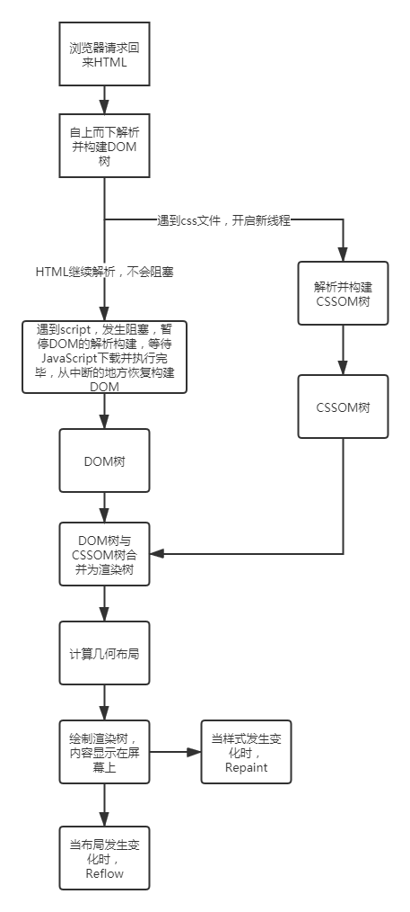

## EventLoop 事件循环

1. js 是单线程，只能顺序执行代码， 但是浏览器有其他线程可以处理异步情况
2. js 引擎执行代码时，遇到同步任务则顺序执行，遇到异步任务则交由 异步事件处理模块处理
3. 异步事件处理模块等事件触发条件达成后，将异步任务分别 加入宏任务队列和微任务队列
4. 同步任务执行完毕后，先执行微任务队列任务，等队列清空时，执行宏任务队列
5. 每一个宏任务 重复 2 步骤

Js 是单线程，为防止一个函数执行时间过长阻塞后面的代码，会先将同步代码压入执行栈中，依次执行，将异步代码放入异步队列。异步队列又分为宏任务和微任务。宏任务执行时间较长，所以微任务要优先于宏任务。微任务：Promise.then 宏任务：setTimeout,setTimeInterval，ajax，一些浏览器 api

Promise 本身是同步的立即执行函数，当执行 resolve 或 reject 的时候，此时是异步操作，会先执行 then/catch,等主栈完成后，才会去调用 resolve/reject 中存放的方法执行。

- 代码示例：

  ```js
  async function async1() {
    console.log("async1 start");
    await async2();
    console.log("async1 end");
  }
  async function async2() {
    console.log("async2 start");
    return new Promise((resolve, reject) => {
      resolve();
      console.log("async2 promise");
    });
  }
  console.log("script start");
  setTimeout(function () {
    console.log("setTimeout");
  }, 0);
  async1();
  new Promise(function (resolve) {
    console.log("promise1");
    resolve();
  })
    .then(function () {
      console.log("promise2");
    })
    .then(function () {
      console.log("promise3");
    });
  console.log("script end");
  // 结果：
  // script start
  // async1 start
  // async2 start
  // async2 promise
  // promise1
  // script end
  // promise2
  // promise3
  // async1 end
  // setTimeout
  ```

## 垃圾回收机制

<a href='https://zhuanlan.zhihu.com/p/60336501'>文章</a>

### 必要性

由于字符串、对象和数组没有固定大小，所以当他们的大小已知时，才能对他们进行动态的存储分配。JavaScript 程序每次创建字符串、数组或对象时，解释器都必须分配内存来存储那个实体。只要像这样动态地分配了内存，最终都要释放这些内存以便他们能够被再用，否则，JavaScript 的解释器将会消耗完系统中所有可用的内存，造成系统崩溃。

### 垃圾回收的方法：标记清除

- 这是最常见的垃圾回收方式，当变量进入环境时，就标记这个变量为”进入环境“,从逻辑上讲，永远不能释放进入环境变量所占用的内存，只要执行流程进入相应的环境，就可能用到他们。当离开环境时，就标记为离开环境。
- 垃圾回收器在运行的时候会给存储在内存中的变量都加上标记（所有都加），然后去掉环境变量中的变量，以及被环境变量中的变量所引用的变量（条件性去除标记），删除所有被标记的变量，删除的变量无法在环境变量中被访问所以会被删除，最后垃圾回收器，完成了内存的清除工作，并回收他们所占用的内存。

### 引用计数

这种方式常常会引起内存泄漏，低版本的 IE 使用这种方式。
工作原理：跟踪记录每个值被引用的次数。
工作流程：

1. 声明了一个变量并将一个引用类型的值赋值给这个变量，这个引用类型值的引用次数就是 1。

2. 同一个值又被赋值给另一个变量，这个引用类型值的引用次数加 1.

3. 当包含这个引用类型值的变量又被赋值成另一个值了，那么这个引用类型值的引用次数 1.

4. 当引用次数变成 0 时，说明没办法访问这个值了。

5. 当垃圾收集器下一次运行时，它就会释放引用次数是 0 的值所占的内存。

该方式会引起内存泄漏的原因是它不能解决循环引用的问题。

循环引用的时候就会释放不掉内存。循环引用就是对象 A 中包含另一个指向对象 B 的指针，B 中也包含一个指向 A 的引用。因为 IE 中的 BOM、DOM 的实现使用了 COM，而 COM 对象使用的垃圾收集机制是引用计数策略。所以会存在循环引用的问题。

## this 指向情况

1. 作为普通函数执行时，this 指向 window
2. 当函数作为对象的方法被调用时，this 指向该对象
3. 箭头函数的 this 绑定的就是最近一层非箭头函数的 this
4. Call，apply，bind 可以显式指定调用函数的 this 指向。Call 接收参数列表，apply 接收数组，bind 方法通过传入一个对象，返回一个 this 绑定了传入对象的新函数。

## 箭头函数和普通函数的区别

（1 ）箭头函数比普通函数更加简洁

- 如果没有参数，就直接写一个空括号即可
- 如果只有一个参数，可以省去参数的括号
- 如果有多个参数，用逗号分割
- 如果函数体的返回值只有一句，可以省略大括号
- 如果函数体不需要返回值，且只有一句话，可以给这个语句前面加一个 void 关键字。最常见的就是调用一个函数：

```javascript
let fn = () => void doesNotReturn();
复制代码;
```

（2）箭头函数没有自己的 this

箭头函数不会创建自己的 this， 所以它没有自己的 this，它只会在自己作用域的上一层继承 this。所以箭头函数中 this 的指向在它在定义时已经确定了，之后不会改变。

（3）箭头函数继承来的 this 指向永远不会改变

```javascript
var id = "GLOBAL";
var obj = {
  id: "OBJ",
  a: function () {
    console.log(this.id);
  },
  b: () => {
    console.log(this.id);
  },
};
obj.a(); // 'OBJ'
obj.b(); // 'GLOBAL'
new obj.a(); // undefined
new obj.b(); // Uncaught TypeError: obj.b is not a constructor
复制代码;
```

对象 obj 的方法 b 是使用箭头函数定义的，这个函数中的 this 就永远指向它定义时所处的全局执行环境中的 this，即便这个函数是作为对象 obj 的方法调用，this 依旧指向 Window 对象。需要注意，定义对象的大括号`{}`是无法形成一个单独的执行环境的，它依旧是处于全局执行环境中。

（4）call()、apply()、bind()等方法不能改变箭头函数中 this 的指向

```javascript
var id = "Global";
let fun1 = () => {
  console.log(this.id);
};
fun1(); // 'Global'
fun1.call({ id: "Obj" }); // 'Global'
fun1.apply({ id: "Obj" }); // 'Global'
fun1.bind({ id: "Obj" })(); // 'Global'
复制代码;
```

（5）箭头函数不能作为构造函数使用

构造函数在 new 的步骤在上面已经说过了，实际上第二步就是将函数中的 this 指向该对象。 但是由于箭头函数时没有自己的 this 的，且 this 指向外层的执行环境，且不能改变指向，所以不能当做构造函数使用。

（6）箭头函数没有自己的 arguments

箭头函数没有自己的 arguments 对象。在箭头函数中访问 arguments 实际上获得的是它外层函数的 arguments 值。

（7）箭头函数没有 prototype

（8）箭头函数不能用作 Generator 函数，不能使用 yeild 关键字

## 阻塞相关问题

- 在 script 元素中的代码被计算完成之前，页面的其余内容不会被 加载，也不会被显示。
- 与解释行内 JavaScript 一样，在解释外部 JavaScript 文件时，页 面也会阻塞。(阻塞时间也包含下载文件的时间。)
- 不管包含的是什么代码，浏览器都会按照 script 在页面中出现的顺序依次解释它们，前提是它 们没有使用 defer 和 async 属性。第二个 script 元素的代码必须在第一个 script 元素的代码解 释完毕才能开始解释，第三个则必须等第二个解释完，以此类推。
- 把所有 script 放在 head 中这种做法的主要目的是把外部的 CSS 和 JavaScript 文件都集中放到一起。不过，把所有 JavaScript 文件都放在<head>里，也就意味着必须把所有 JavaScript 代码都下载、解析和解释完成后，才能开始渲 染页面(页面在浏览器解析到<body>的起始标签时开始渲染)。对于需要很多 JavaScript 的页面，这会 导致页面渲染的明显延迟，在此期间浏览器窗口完全空白。为解决这个问题，现代 Web 应用程序通常 将所有 JavaScript 引用放在<body>元素中的页面内容后面
- 对不推迟执行的脚本，浏览器必须解释完位于<script>元素中的代码，然后才能继续渲染页面 的剩余部分

1. css 加载不会阻塞 DOM 树的解析
2. css 加载会阻塞 DOM 树的渲染
3. css 加载会阻塞后面 js 语句的执行

- js 会堵塞 DOM 树的解析
- 当 JS 面前有一个 link css ，无论两者谁先下载完毕，JS 都会等待 CSS 加载并解析完成后再执行。这是因为浏览器不知道 JS 是否会需要查询 CSSDOM，所以需要等待 CSS 准备完毕
- 渲染必须依赖 CSSDOM 树，可以认为 CSS 是堵塞渲染，但是不堵塞 DOM 解析

- 遇到同步 js，下载并执行。async js 异步下载完就执行，打断 dom 解析。defer js 异步下载，待 dom 解析完再执行。

- 会阻塞 dom 解析的资源有：

  - 内联 css
  - 内联 js
  - 普通外联 js
  - 外联 defer js
  - js 之前的外联 css

### main1.css 和 main2.css 同时开始加载，先加载完成的优先解析

css 是按照顺序解析；优先下载完的先解析；解析的先后不影响 css 相同规则后面的覆盖前面的；它是和位置有关；和解析没关系；

### defer:

如果 JavaScript 文件中没有操作 DOM 相关代码，就可以将该 JavaScript 脚本设置为异步加载，通过 async 或 defer 来标记代码

### async

async 和 defer 虽然都是异步的，不过还有一些差异，使用 async 标志的脚本文件一旦加载完成，会立即执行；而使用了 defer 标记的脚本文件，需要在 DOMContentLoaded 事件之前执行。

### CSS 阻塞

CSS HTML 都是阻塞页面渲染的因素之一, 因为渲染树需要同时具有 DOM 树、 CSSOM 树, 才能开始构建
浏览器解析 HTML 时,遇到了 CSS 资源, 会并行解析和构建 CSSOM DOM
所以 CSS 不会阻塞 HTML 的解析, 但是会阻塞渲染树的构建
所以需要尽可能快地提供 CSS 样式, 尽量放在 head 标签内。
但是: CSS 也会阻塞 JS 脚本的执行!!
有这么一种情况, CSS 解析不是不影响 HTML 解析嘛, CSS 解析过程中, HTML 解析到一个 script 标签, 这时会去加载这个脚本, 但加载完之后必须等到前面的 CSSOM 构建完成才会执行

### JS 阻塞

遇到 JS 脚本的时候, 会阻塞 HTML 解析, 马上去加载脚本, 加载完后就执行

### 浏览器对页面的渲染过程

1. 处理 HTML 标记并构建 DOM 树。
2. 处理 CSS 标记并构建 CSSOM 树。
3. 将 DOM 与 CSSOM 合并成一个渲染树。
4. 根据渲染树来布局，计算每个节点的几何信息。
5. 将各个节点绘制到屏幕上。

1、IE 下载的顺序是从上到下，渲染的顺序也是从上到下，下载和渲染是同时进行的。
2、在渲染到页面的某一部分时，其上面的所有部分都已经下载完成（并不是说所有相关联的元素都已经下载完）
3、如果遇到语义解释性的标签嵌入文件（JS 脚本，CSS 样式），那么此时 IE 的下载过程会启用单独连接进行下载。
4、并且在下载后进行解析，解析过程中，停止页面所有往下元素的下载。阻塞加载
5、样式表在下载完成后，将和以前下载的所有样式表一起进行解析，解析完成后，将对此前所有元素（含以前已经渲染的）重新进行渲染。
6、JS、CSS 中如有重定义，后定义函数将覆盖前定义函数

但上述过程不一定会按顺序执行下来, 可能会被阻塞。
假如 DOM CSSOM 被修改, 以上过程会重复执行

### 2. JS 的加载

2.1 不能并行下载和解析（阻塞下载）
2.2 当引用了 JS 的时候，浏览器发送 1 个 js request 就会一直等待该 request 的返回。因为浏览器需要 1 个稳定的 DOM 树结构，而 JS 中很有可能有代码直接改变了 DOM 树结构，比如使用 document.write 或 appendChild,甚至是直接使用的 location.href 进行跳转，浏览器为了防止出现 JS 修改 DOM 树，需要重新构建 DOM 树的情况，所以 就会阻塞其他的下载和呈现。

## 解析 HTML 流程


注意一下几点：

1. 解析过程遇到 script 时，如果此时浏览器尚未完成 cssom 的下载构建，浏览器会延迟脚本执行和 DOM 构建，直到浏览器完成 cssom 构建

2. 向 script 标记添加异步关键词，可以指示浏览器在脚本等待执行的过程中不暂停 DOM 构建，让脚本就绪之后再执行脚本

3. 在开发中我们可以在 script 中声明两个属性来控制外部脚本的执行：defer 和 async，下面分别解释了他们的用法：

defer：用于开启新的线程下载脚本文件，并使脚本在文档解析完成后执行。
async：HTML5 新增属性，用于异步下载脚本文件，下载完毕立即解释执行代码。

## 为什么 JavaScript 是单线程？

JavaScript 语言的一大特点就是单线程，也就是说，同一个时间只能做一件事。
JavaScript 的单线程，与它的用途有关。作为浏览器脚本语言，JavaScript 的主要用途是与用户互动，以及操作 DOM。
这决定了它只能是单线程，否则会带来很复杂的同步问题。比如，假定 JavaScript 同时有两个线程，一个线程在某个 DOM 节点上添加内容，另一个线程删除了这个节点，这时浏览器应该以哪个线程为准？
单线程就意味着，所有任务需要排队，前一个任务结束，才会执行后一个任务。如果前一个任务耗时很长，后一个任务就不得不一直等着。
一种是同步任务（synchronous），另一种是异步任务（asynchronous）。
同步任务指的是，在主线程上排队执行的任务，只有前一个任务执行完毕，才能执行后一个任务；
异步任务指的是，不进入主线程、而进入”任务队列”（task queue）的任务，只有”任务队列”通知主线程，某个异步任务可以执行了，

## async..await

await 会阻塞代码，也许之后的异步代码并不依赖于前者，但仍然需要等待前者完成，导致代码失去了并发性
await 会等待 sleep 函数 resolve ，所以即使后面是同步代码，也不会先去执行同步代码再来执行异步代码。
await 如同他的语意，就是在等待，等待右侧的表达式完成。此时的 await 会让出线程，阻塞 async 内后续的代码，先去执行 async 外的代码。等外面的同步代码执行完毕，才会执行里面的后续代码。就算 await 的不是 promise 对象，是一个同步函数，也会等这样操作

```js
function sleep() {
  return new Promise((resolve) => {
    setTimeout(() => {
      console.log("finish");
      // resolve("sleep");
    }, 2000);
  });
}
async function test() {
  let value = await sleep();
  console.log("object");
}
test();
// 没有resolve输出finish，有resolve输出finish，object
```

## 判断类型三方法

### typeof

typeof 是一个操作符，其右侧跟一个一元表达式，并返回这个表达式的数据类型。返回的结果用该类型的字符串(全小写字母)形式表示，包括以下 7 种：number、boolean、symbol、string、object、undefined、function 等。

```js
typeof ""; // string 有效
typeof 1; // number 有效
typeof Symbol(); // symbol 有效
typeof true; //boolean 有效
typeof undefined; //undefined 有效
typeof null; //object 无效
typeof []; //object 无效
typeof new Function(); // function 有效
typeof new Date(); //object 无效
typeof new RegExp(); //object 无效
```

有些时候，typeof 操作符会返回一些令人迷惑但技术上却正确的值：

对于基本类型，除 null 以外，均可以返回正确的结果。
对于引用类型，除 function 以外，一律返回 object 类型。
对于 null ，返回 object 类型。
对于 function 返回 function 类型。

### instanceOf

instanceof 是用来判断 A 是否为 B 的实例，表达式为：A instanceof B，如果 A 是 B 的实例，则返回 true,否则返回 false。 在这里需要特别注意的是：instanceof 检测的是原型
instanceof 只能用来判断两个对象是否属于实例关系， 而不能判断一个对象实例具体属于哪种类型。

```js
function myInstanceof(left, right) {
  let proto = Object.getPrototypeOf(left), // 获取对象的原型
    prototype = right.prototype; // 获取构造函数的 prototype 对象

  // 判断构造函数的 prototype 对象是否在对象的原型链上
  while (true) {
    if (!proto) return false;
    if (proto === prototype) return true;

    proto = Object.getPrototypeOf(proto);
  }
}
```

### Object.prototype.toString.call()

所有 typeof 返回值为 "object" 的对象（如数组）都包含一个内部属性 [[Class]]（我们可以把它看作一个内部的分类

同样是检测对象 obj 调用 toString 方法，obj.toString()的结果和 Object.prototype.toString.call(obj)的结果不一样，这是为什么？

这是因为 toString 是 Object 的原型方法，而 Array、function 等**类型作为 Object 的实例，都重写了 toString 方法**。不同的对象类型调用 toString 方法时，根据原型链的知识，调用的是对应的重写之后的 toString 方法（function 类型返回内容为函数体的字符串，Array 类型返回元素组成的字符串…），而不会去调用 Object 上原型 toString 方法（返回对象的具体类型），所以采用 obj.toString()不能得到其对象类型，只能将 obj 转换为字符串类型；因此，在想要得到对象的具体类型时，应该调用 Object 原型上的 toString 方法。

## Js 各种循环之间的性能对比

### 1.普通 for 循环:平均耗时约：674.267ms

```js
console.log("-----普通for循环-------");
console.time("for");
const result_1 = [];
for (let i = 0; i < data.length; i++) {
  result_1.push(data[i]);
}
console.timeEnd("for");
console.log("-----执行完毕-------");
```

### 2.for of:平均耗时约：1095.000ms

```js
console.log("-----for of-------");
console.time("for_of");
const result_2 = [];
for (let item of data) {
  result_2.push(item);
}
console.timeEnd("for_of");
console.log("-----执行完毕-------");
```

### 3.for in:平均耗时约：9213.187ms

```js
console.log("-----for in-------");
console.time("for_in");
const result_3 = [];
for (let key in data) {
  result_3.push(data[key]);
}
console.timeEnd("for_in");
console.log("-----执行完毕-------");
```

### 4.forEach:平均耗时约：1022.339ms

```js
console.log("-----forEach-------");
console.time("forEach");
const result_4 = [];
data.forEach((item) => {
  result_4.push(item);
});
console.timeEnd("forEach");
console.log("-----执行完毕-------");
```

### 5.map:平均耗时约：6751.867ms

```js
console.log("-----map-------");
console.time("map");
const result_5 = [];
data.map((item) => {
  result_5.push(item);
});
console.timeEnd("map");
console.log("-----执行完毕-------");
```

### 总结：

普通 for 循环 > forEach > for of > map > for in，如果只考虑性能，遍历的时候优先考虑 for 循环；但不应只考虑性能还要考虑代码语义性和可维护性。

## toFixed（）问题

规则并不是所谓的“四舍五入”或者是“四舍六入五成双”，所谓“四舍六入五成双”，在百度百科上给的解释是：也即“4 舍 6 入 5 凑偶”这里“四”是指 ≤4 时舍去，"六"是指 ≥6 时进上，"五"指的是根据 5 后面的数字来定，当 5 后有数时，舍 5 入 1；当 5 后无有效数字时，需要分两种情况来讲：①5 前为奇数，舍 5 入 1；②5 前为偶数，舍 5 不进。（0 是最小的偶数） 。

## onClick 和 addEventListener 的区别

1.onclick 事件在同一时间只能指向唯一对象

2.addEventListener 给一个事件注册多个 listener

3.addEventListener 对任何 DOM 都是有效的，而 onclick 仅限于 HTML

4.addEventListener 可以控制 listener 的触发阶段，（捕获/冒泡）。对于多个相同的事件处理器，不会重复触发，不需要手动使用 removeEventListener 清除

## 0.1+0.2 不等于 0.3

JavaScript 计算的翻车现场

    所以，为什么会出现这样的结果呢？哪些计算又会出现这样的问题呢，让我们一步步的来分析一下~~~

2、JavaScript 是如何表示数字的

计算机遵循 IEEE 754 标准 ，是将信息转化为二进制进行存储的，JavaScript 使用 Number 类型表示数字（整数和浮点数），而 JS 采用的是双精度版本，也就是通过 64 位来表示一个数字，具体如下：（1 + 11 + 52）
注意：虽然只有 52 位来表示有效数字，但是 JS 的最大安全数字是 JS_NUMBER_MAX_SAFE_INTEGER == Math.pow( 2，53）- 1 而不是 Math.pow( 2，52）- 1（转成整数就是 16 位），这是因为二进制表示有效数字总是 1.xx…xx 的形式，尾数部分 f 在规约形式下第一位默认为 1（省略不写，xx..xx 为尾数部分 f，最长 52 位）。因此，JavaScript 提供的有效数字最长为 53 个二进制位（64 位浮点的后 52 位+被省略的 1 位）

3、运算时发生了什么

    一、进制转换

十进制整数转化为二进制整数（除 2 取余，自下而上，逆序排列）
十进制小数转化为二进制小数（乘 2 取整，自上而下，顺序排列）
由上面可知：173 -----> 10101101

            0.8125 -----> 0.1101

            173.8125 -----> 10101101.1101

在工具中直观的表示两者在计算机内存中的表现形式
0.1 -----> 0 0011 0011 0011.....（无限循环）
0.2 -----> 0011 0011 0011.....（无限循环）

由此可以看出，0.1 与 0.2 都是无限循环小数，JS 的双精度版本会对这种小数的二进制进行截取有效位数，从而造成精度丢失。
由于 JS 的最大安全数字是 16 位，因此我们可以通过 number.toPrecision(16)来进行精度运算，超过的部分会自动进行凑整处理。
二、对阶运算

由于指数位数不相同，运算时需要进行对阶运算，因此也有可能造成精度丢失。
！！！结果：精度丢失可能出现在进制转化或者对阶运算中

3、以后如何解决

Number.prototype.toFixed(digits)精度为 0-20 之间，返回一个数值的字符串形式
Math.js
big.js
等等
4、参考资料（哈哈哈，尊重作者，其实我就是写了一遍加深记忆~~~）

https://juejin.cn/post/6844903680362151950

### 解决方案

Math.formatFloat = function(f, digit) {
var m = Math.pow(10, digit);
return parseInt(f \* m, 10) / m;
}

var numA = 0.1;
var numB = 0.2;

alert(Math.formatFloat(numA + numB, 1) === 0.3);

<!-- 这个方法是什么意思呢？为了避免产生精度差异，我们要把需要计算的数字乘以 10 的 n 次幂，换算成计算机能够精确识别的整数，然后再除以 10 的 n 次幂，大部分编程语言都是这样处理精度差异的，我们就借用过来处理一下 JS 中的浮点数精度误差。 -->

## new 调用函数，且里边有 return

如果用 new 调用函数，而这个函数中有 return，那它 return 出来的是什么？

1. 如果没有写 return 就是返回这个新创建的对象。
2. 如果返回值是非对象类型的数据（比如写了个 return 0;），那么还是正常返回这个新创建的对象。
3. 如果写了对象类型的返回值，那么就返回这个显式声明的对象。

## new 运算符实现步骤

### new 运算符的实现机制

1. 首先创建了一个新的空对象
2. 设置原型，将构造函数的作用域赋给新对象（也就是将对象的**proto**属性指向构造函数的 prototype 属性）
3. 指向构造函数中的代码，构造函数的 this 指向该对象（也就是为这个对象添加属性和方法）
4. 返回 this 指向的新对象，也就是实例（如果没有手动返回其他的对象）

### 具体实现

```js
// 构造器函数
let Parent = function (name, age) {
  this.name = name;
  this.age = age;
};
Parent.prototype.sayName = function () {
  console.log(this.name);
};
//自己定义的new方法
let newMethod = function (Parent, ...rest) {
  // 1.以构造器的prototype属性为原型，创建新对象；
  let child = Object.create(Parent.prototype);
  // 2.将this和调用参数传给构造器执行
  let result = Parent.apply(child, rest);
  // 3.如果构造器没有手动返回对象，则返回第一步的对象
  return typeof result === "object" ? result : child;
};
//创建实例，将构造函数Parent与形参作为参数传入
const child = newMethod(Parent, "echo", 26);
child.sayName(); //'echo';

//最后检验，与使用new的效果相同
child instanceof Parent; //true
child.hasOwnProperty("name"); //true
child.hasOwnProperty("age"); //true
child.hasOwnProperty("sayName"); //false
```

## 闭包

### 是什么

- 要理解闭包，首先理解 javascript 特殊的变量作用域，变量的作用于无非就是两种：全局变量，局部变量。
- javascript 语言的特殊处就是函数内部可以读取外部作用域中的变量。
- 我们有时候需要得到函数内的局部变量，但是在正常情况下，这是不能读取到的，这时候就需要用到闭包。在 javascript 语言中，只有函数内部的子函数才能读取局部变量，因此可以把闭包简单理解成“定义在一个函数内部的函数”。闭包是指有权访问另一个函数作用域中的变量的函数。其本质是函数的作用域链中保存着外部函数变量对象的引用。

```js
function init() {
  var name = "Mozilla"; // name 是一个被 init 创建的局部变量
  function displayName() {
    // displayName() 是内部函数，一个闭包
    alert(name); // 使用了父函数中声明的变量
  }
  displayName();
}
init();
```

`displayName()` 没有自己的局部变量。然而，由于闭包的特性，它可以访问到外部函数的变量

### 使用场景

任何闭包的使用场景都离不开这两点：

- 创建私有变量
- 延长变量的生命周期

具体点：

- 函数作为参数被传递
- 函数作为返回值被返回
- 封装功能时(需要使用私有的属性和方法)，
- 函数防抖、函数节流

### 优点

- 变量长期驻扎在内存中
- 另一个就是可以重复使用变量，并且不会造成变量污染
  ① 全局变量可以重复使用，但是容易造成变量污染。不同的地方定义了相同的全局变量,这样就会产生混乱。”
  ② 局部变量仅在局部作用域内有效，不可以重复使用，不会造成变量污染。
  ③ 闭包结合了全局变量和局部变量的优点。可以重复使用变量，并且不会造成变量污染

### 缺点

由于闭包会使得函数中的变量都被保存在内存中，内存消耗很大，所以不能滥用闭包，否则会造成网页的性能问题，在 IE 中可能导致内存泄露。解决方法是，在退出函数之前，将不使用的局部变量全部删除。

## 内存泄漏

在计算机科学中，内存泄漏指由于疏忽或错误造成程序未能释放已经不再使用的内存。内存泄漏并非指内存在物理上的消失，而是应用程序分配某段内存后，由于设计错误，导致在释放该段内存之前就失去了对该段内存的控制，从而造成了内存的浪费。
如果内存不需要时，没有经过生命周期的释放期，那么就存在内存泄漏。

内存泄漏简单理解：无用的内存还在占用，得不到释放和归还。比较严重时，无用的内存会持续递增，从而导致整个系统卡顿，甚至崩溃。

JavaScript 内存管理机制
JavaScript 内存管理机制和内存的生命周期是一一对应的。首先需要分配内存，然后使用内存，最后释放内存。

其中 JavaScript 语言不需要程序员手动分配内存，绝大部分情况下也不需要手动释放内存，对 JavaScript 程序员来说通常就是使用内存（即使用变量、函数、对象等）。

内存分配
JavaScript 定义变量就会自动分配内存的。我们只需了解 JavaScript 的内存是自动分配的就足够了。

### JavaScript 内存泄漏的一些场景

JavaScript 的内存回收机制虽然能回收绝大部分的垃圾内存，但是还是存在回收不了的情况。程序员要让浏览器内存泄漏，浏览器也是管不了的。

下面有些例子是在执行环境中，没离开当前执行环境，还没触发标记清除法。所以你需要读懂上面 JavaScript 的内存回收机制，才能更好理解下面的场景。

1. 意外的全局变量

   ```js
   // 在全局作用域下定义
   function count(number) {
     // basicCount 相当于 window.basicCount = 2;
     basicCount = 2;
     return basicCount + number;
   }
   ```

2. 被遗忘的计时器
   无用的计时器忘记清理是新手最容易犯的错误之一。
   上面的组件销毁的时候，setInterval 还是在运行的，里面涉及到的内存都是没法回收的（浏览器会认为这是必须的内存，不是垃圾内存），需要在组件销毁的时候清除计时器

3. 被遗忘的事件监听器(window.addEventListener)
   无用的事件监听器忘记清理是新手最容易犯的错误之一。
   需要在组件销毁的时候移除相关的事件(window.removeEventListener)

### 如何发现内存泄漏

打开谷歌开发者工具，切换至 Performance 选项，勾选 Memory 选项。

在页面上点击运行按钮，然后在开发者工具上面点击左上角的录制按钮，10 秒后在页面上点击停止按钮，5 秒后停止内存录制。得到的内存走势如下：

具体请看:<a href='https://segmentfault.com/a/1190000020231307'>文章</a>

## require 和 import

### 区别 1：模块加载的时间

require：运行时加载
import：编译时加载（效率更高）【由于是编译时加载，所以 import 命令会提升到整个模块的头部】

### 区别 2：模块的本质

require：模块就是对象，输入时必须查找对象属性
import：ES6 模块不是对象，而是通过 export 命令显式指定输出的代码，再通过 import 命令输入（这也导致了没法引用 ES6 模块本身，因为它不是对象）。由于 ES6 模块是编译时加载，使得静态分析成为可能。有了它，就能进一步拓宽 JavaScript 的语法，比如引入宏（macro）和类型检验（type system）这些只能靠静态分析实现的功能。

```js
// CommonJS模块
let { exists, readFile } = require("fs");
// 等同于
let fs = require("fs");
let exists = fs.exists;
let readfile = fs.readfile;
```

上面 CommonJs 模块中，实质上整体加载了 fs 对象（fs 模块），然后再从 fs 对象上读取方法

```js
// ES6模块
import { exists, readFile } from "fs";
```

上面 ES6 模块，实质上从 fs 模块加载 2 个对应的方法，其他方法不加载

### 区别 3：严格模式

CommonJs 模块和 ES6 模块的区别：
（1）CommonJs 模块默认采用非严格模式
（2）ES6 的模块自动采用严格模式，不管你有没有在模块头部加上 “use strict”;
（3）CommonJS 模块输出的是一个值的拷贝，ES6 模块输出的是值的引用，举例如下

```js
// m1.js
export var foo = "bar";
setTimeout(() => (foo = "baz"), 500);
// m2.js
import { foo } from "./m1.js";
console.log(foo); //bar
setTimeout(() => console.log(foo), 500); //baz
```

ES6 模块之中，顶层的 this 指向 undefined ，即不应该在顶层代码使用 this

## JS 的编译顺序

JavaScript 是一种描述型脚本语言，它不同于 java 或 C#等编译性语言,它不需要进行编译成中间语言,而是由浏览器进行动态地解析与执行。
JavaScript 中的代码块是指由<script>标签分割的代码段。

### 代码块

```js
<script type="text/javascript">
alert(str);
//因为没有定义str，所以浏览器会出错，下面的不能运行
alert(
"我是代码块一"
);
//没有运行到这里
var test =
"我是代码块一变量"
;
</script>


<script type="text/javascript">
alert(
"我是代码块二"
);
//这里有运行到
alert(test);
//弹出"我是代码块一变量"
</script>
```

上面的代码中代码块一中运行报错，但不影响代码块二的执行，这就是代码块间的独立性，而代码块二中能调用到代码一中的变量，则是块间共享性。

### 声明式函数与赋值式函数

```js
function fn() {} //声明式函数

var fn = function () {}; // 赋值式函数
```

声明式函数与赋值式函数的区别在于：在 JS 的预编译期，声明式函数将会先被提取出来，然后才按顺序执行 js 代码。

### 预编译期与执行期

事实上，JS 的解析过程分为两个阶段：预编译期(预处理)与执行期。

预编译期 JS 会对本代码块中的所有声明的变量和函数进行处理（类似与 C 语言的编译），但需要注意的是此时处理函数的只是声明式函数，而且变量也只是进行了声明但未进行初始化以及赋值。

## Promise

### Promise 是什么

Promise 是一种用于解决异步问题的思路、方案或者对象方式。有三种状态，pending（进行中）、resolved（已完成）、rejected（已失败）。当 Promise 的状态由 pending 转变为 resolved 或者 reject 时，会执行相应的方法。
Promise 的特点是只有异步操作的结果，可以决定当前是哪一种状态，任务其余操作都无法改变这个状态，也是“Promise”的名称的由来，同时，状态一旦改变，就无法再次改变状态

### Promise 解决的痛点是什么

解决了回调地狱的痛点，它的痛点有：

- 代码臃肿。
- 可读性差。
- 耦合度过高，可维护性差。
- 代码复用性差。
- 容易滋生 bug。
- 只能在回调里处理异常。

### Promise 常用的方法有哪些？它们的作用是什么？

- then

  then 方法用于注册当状态变为 fulfilled 或者 reject 时的回调函数

  ```js
  const promise = new Promise((resolve, reject) => {});
  promise.then(
    (result) => {
      // fulfilled
    },
    (reason) => {
      // reject
    }
  );
  ```

- catch

  catch 在链式写法中可以捕获前面 then 中发送的异常。

- all

  类方法，多个 Promise 任务同时执行。
  如果全部成功执行，则以数组的方式返回所有 Promise 任务的执行结果。 如果有一个 Promise 任务 rejected，则只返回 rejected 任务的结果。

- race
  类方法，多个 Promise 任务同时执行，返回最先执行结束的 Promise 任务的结果，不管这个 Promise 结果是成功还是失败。 。

- any
  有一个子实例成功就算成功，全部子实例失败才算失败

- finally
  在当前 promise 实例执行完 then 或者 catch 后，均会触发。

### Promise 事件循环

- 事件循环
  从代码执行顺序的角度来看，程序最开始是按代码顺序执行代码的，遇到同步任务，立刻执行；遇到异步任务，则只是调用异步函数发起异步请求。此时，异步任务开始执行异步操作（微任务先执行宏任务后执行），执行完成后到消息队列中排队。程序按照代码顺序执行完毕后，查询消息队列中能否有等待的消息。假如有，则按照次序从消息队列中把消息放到执行栈中执行。执行完毕后，再从消息队列中获取消息，再执行，不断重复。因为主线程不断的重复取得消息、执行消息、再取消息、再执行

- promise 的事件循环
  Promise 在初始化时，传入的函数是同步执行的，而后注册 then 回调。注册完之后，继续往下执行同步代码，在这之前，then 中回调不会执行。同步代码块执行完毕后，才会在事件循环中检测能否有可用的 promise 回调，假如有，那么执行，假如没有，继续下一个事件循环

## preload 和 prefetch 两个的概念

### preload

<link>元素的 rel 属性的属性值preload能够让你在你的HTML页面中<head>元素内部书写一些声明式的资源获取请求，可以指明哪些资源是在页面加载完成后即刻需要的。

preload 提供了一种声明式的命令，让浏览器提前加载指定资源(加载后并不执行)，需要执行时再执行。

```js
<link rel="preload" href="https://tiven.cn/js/test.js" as="javascript" onload="preloadHandle()">
```

#### preload 好处

- 将加载和执行分离开，不阻塞渲染和 document 的 onload 事件。
- 提前加载指定资源，不再出现依赖的 font 字体隔了一段时间才刷出的情况。

#### 注意：

- 使用 preload 后，不管资源是否使用都将提前加载。若不确定资源是必定会加载的，则不要错误使用 preload，以免出现性能问题。
- preload 有 as 属性，浏览器可以设置正确的资源加载优先级，这种方式可以确保资源根据其重要性依次加载， 所以，preload 既不会影响重要资源的加载，又不会让次要资源影响自身的加载；浏览器能根据 as 的值发送适当的 Accept 头部信息；浏览器通过 as 值能得知资源类型，因此当获取的资源相同时，浏览器能够判断前面获取的资源是否能重用。
- 如果忽略 as 属性，或者错误的 as 属性会使 preload 等同于 XHR 请求，浏览器不知道加载的是什么，因此会赋予此类资源非常低的加载优先级。
- 如果对所 preload 的资源不使用明确的 as 属性，将会导致二次获取。
- preload 加载 font 字体资源不带 crossorigin 也会二次获取。

### prefetch

#### 定义：

<link>元素的 rel 属性的属性值prefetch能够让你在你的HTML页面中<head>元素内部书写一些声明式的资源获取请求，告诉浏览器加载下一页面可能会用到的资源，注意是下一页面，而不是当前页面。因此该方法的加载优先级非常低，也就是说该方式的作用是加速下一个页面的加载速度。

```js
<link rel="prefetch" href="./js/01.js">
<link rel="prefetch" href="./js/02.js">
```

#### preload 和 prefetch 的区别

- preload 是告诉浏览器页面必定需要的资源，浏览器一定会加载这些资源。
- prefetch 是告诉浏览器页面可能需要的资源，浏览器不一定会加载这些资源。
- 在 VUE SSR 生成的页面中，首页的资源均使用 preload，而路由对应的资源，则使用 prefetch。
- 对于当前页面很有必要的资源使用 preload，对于可能在将来的页面中使用的资源使用 prefetch。

注意： 使用 preload 和 prefetch 的逻辑可能不是写到一起，但一旦发生对用一资源 preload 或 prefetch 的话，会带来双倍的网络请求。

## AMD 和 CMD 的区别

1. 对于依赖的模块，AMD 是提前执行，CMD 是延迟执行。不过 RequireJS 从 2.0 开始，也改成可以延迟执行（根据写法不同，处理方式不同）。CMD 推崇 as lazy as possible.
2. CMD 推崇依赖就近，AMD 推崇依赖前置。

AMD 加载完模块后，就立马执行该模块；CMD 加载完某个模块后没有立即执行而是等到遇到 require 语句的时再执行。

所以，他们两者的不同导致各自的优点是 AMD 用户体验好，因为模块提前执行了；CMD 性能好，因为只有用户需要的时候才执行。

## 对 Js 的理解

1. java javascript 的关系,其实没什么关系,唯一的关系就是蹭热度.
2. js 是一种直译型,弱类型的脚本语言,直接翻译 moring good 弱类型不一定需要分号,脚本:依靠其他语言 js 必须在 HTML 中被引用,
3. js 历史:最早是为了解决表单验证的问题
4. js 的组成部分 ECMAScript(标准语法)+BOM(浏览器对象模型)+DOM(文档对象模型)
5. js 引入方法:内部 Js 和外部 Js
6. 数据类型之间的相互转化

## onload 与 DOMContentloaded 区别？

### DOM 完整的解析过程

1. 解析 HTML 结构。
2. 加载外部脚本和样式表文件。
3. 解析并执行脚本代码。//js 之类的
4. DOM 树构建完成。//DOMContentLoaded
5. 加载图片等外部文件。
6. 页面加载完毕。//load
   在第 4 步的时候 DOMContentLoaded 事件会被触发。
   在第 6 步的时候 load 事件会被触发。

### 何时触发这两个事件？

1. 当 onload 事件触发时，页面上所有的 DOM，样式表，脚本，图片，flash 都已经加载完成了。

2. 当 DOMContentLoaded 事件触发时，仅当 DOM 加载完成，不包括样式表，图片，flash。

### 为什么要区分？

开发中我们经常需要给一些元素的事件绑定处理函数。但问题是，如果那个元素还没有加载到页面上，但是绑定事件已经执行完了，是没有效果的。这两个事件大致就是用来避免这样一种情况，将绑定的函数放在这两个事件的回调中，保证能在页面的某些元素加载完毕之后再绑定事件的函数。

当然 DOMContentLoaded 机制更加合理，因为我们可以容忍图片，flash 延迟加载，却不可以容忍看见内容后页面不可交互。

这里又要牵扯到页面加载渲染的原理了：
