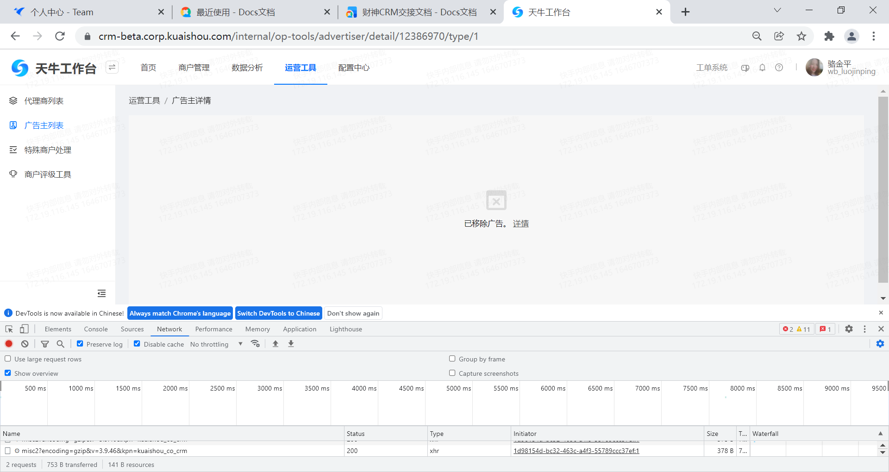
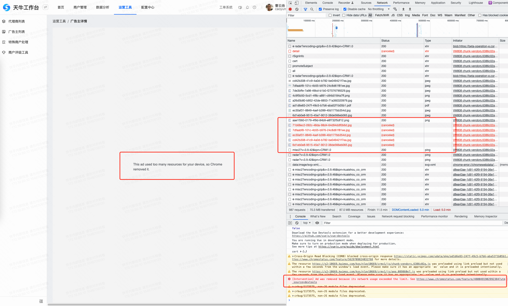
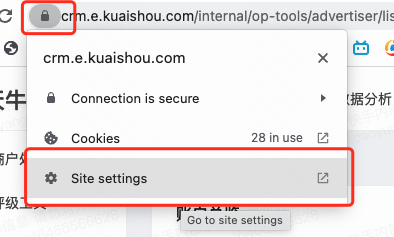

## 问题

最近测试同学发现我们嵌入的页面可能会被 Chrome 自带的广告拦截功能屏蔽，个人猜测可能跟下面的原因有关︰

- 网比较慢、测试同学的电脑性能较低等因素让浏览器判定广告内容对性能影响过大而触发屏蔽

- 网址中存在 ad 字段触发了广告屏蔽机制

这个问题对于需求的如期上线存在一定风险，导致开发很被动。
使用微前端的技术方案替代 iframe 的开发成本如何?
以后开发类似 iframe 嵌入需求时是否应该评估类似风险?
</img>
</img>

## 问题原因

为了解决使用浏览器挖矿，广告加载等影响用户体的问题。Chrome 85 开启了广告干预功能（Chrome heavy ad intervention），对于 iframe 加载的内容，如果没有用户交互，会限制其资源使用量，满足以下任何一条时，可能会触发浏览器干预机制将 iframe 移除：
● 使用主线程的 CPU 时间总计超过 60 秒
● 在任何 30 秒的时间窗口中使用主线程 CPU 时间超过 15 秒
● 使用超过 4M 的带宽

并在控制台显示报错信息如下：

```txt
[Intervention] Ad was removed because its network usage exceeded the limit. See https://www.chromestatus.com/feature/4800491902992384?utm_source=devtools

```

本次问题是由于某些客户上传的资质文件较大，且后端没有做任何缩略图处理，前端也没有采取任何懒加载措施。如下图所示，图片总共有 20+M。

和 ad 关键字没关系，不过一些第三方插件会根据关键字拦截请求

## 解决方案

a. 多刷新几次页面
由于从缓存加载的内容不算网络传输，所以同一个资源多刷新几次，如果带缓存的话就可以避免拦截。复现问题时也要清空缓存才行，只是勾选 Disable Cache 是不能复现的。
b. 关闭广告拦截功能
按照图示操作关闭广告拦截功能
</img>
c. 资源延迟加载
延迟加载较大的图片。由于加载图片行为是产生了用户交互后才产生的，此时不会被拦截
</img>

## 防范机制

● 开发时，即使是 toB 的页面，也要注意用户体验和加载性能
● 在 iframe 中，如果确实需要加载大量内容，可以把拉取数据的操作放在产生用户交互以后
● 尽量避免在新的项目中使用 iframe 进行系统嵌入的技术方案
